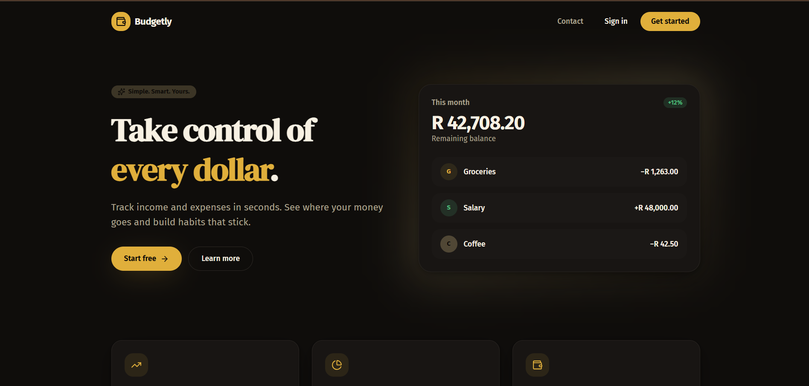

# Budgetly — Smart Budget Tracker

A classy, noir-and-gold personal finance app to track income, expenses, and savings in South African Rand (ZAR).

🌐 **Live site:** [smart-money-budget-tracker.lovable.app](https://smart-money-budget-tracker.lovable.app)



## Project Brief

The Smart Budget Tracker helps users take control of their personal finances by making it effortless to log income and expenses, set monthly budgets, visualize spending, and work toward savings goals.

### Objectives
- Record daily income and expenses in seconds
- Create and monitor monthly budgets
- View spending summaries and category breakdowns
- Track progress toward savings goals

### Core Features
- 🔐 Email/password and Google sign-in
- 💸 Income & expense tracking with categories (in ZAR)
- 📊 Monthly balance, income, and expense summaries
- 🔍 Transaction search and filtering
- 💬 Built-in support chatbot (no sign-in required) for off-hours help

### Tech Stack
- **Frontend:** React 19 + TanStack Start + Vite 7
- **Styling:** Tailwind CSS v4 (custom Noir & Gold theme, DM Serif Display + Fira Sans)
- **Backend:** Lovable Cloud (auth, database, server functions)
- **AI:** Lovable AI Gateway (support chatbot)

## Project Phases
1. **Planning** — scope, features, resources
2. **Design** — Noir & Gold visual system
3. **Development** — auth, dashboard, chatbot
4. **Testing** — flows and RLS validation
5. **Deployment** — published on Lovable

## Support
- **CEO:** Thandokuhle Mdluli
- **WhatsApp:** 066 372 5168
- **Email:** thandokuhle.mdluli29s@gmail.com
- **Branch:** Marikana Ext 3, Building T0859, Kwa-Thema, Springs, Johannesburg, Gauteng

## Development

```sh
npm i
npm run dev
```

Built with [Lovable](https://lovable.dev).
